# Relatório "Sistema de Consulta e Análise de Publicações Científicas"

## Docentes responsáveis: Luís Filipe Cunha e José Carlos Ramalho

## Nomes e números das alunas que realizaram o projeto:

* Joana Maria Fernandes Campos (a107229)
* Leticia da Costa Rodrigues (A108960)
* Marta Alexandra da Costa Capa (A107232)

## Curso: Engenharia Biomédica

## Ano letivo: 2024/2025

## Introdução

Num mundo onde o volume de publicações científicas cresce exponencialmente, torna-se cada vez mais desafiador gerir a análise desses documentos de uma forma eficiente, assim sendo há uma necessidade crescente de ferramentas que nos facilitam a organização e pesquisa, especialmente para investigadores e estudantes.
É neste contexto que surge o presente projeto no âmbito da unidade curricular "Algoritmos e Técnicas de Programação", os docentes responsabilizaram-nos pela criação de um sistema em Python que permita atualizar, criar e analisar publicações científicas, incidindo sobre um dataset de artigos médicos, devemos garantir que o sistema se encontra apto para reconhecer outros ficheiros do mesmo tipo, o sistema deverá conter uma pesquisa de artigos usando filtros relevantes, tais como a data de publicação, as palavras-chave, autores, entre outros, ainda devem ser gerados relatórios, que deveram revelar gráficos ilustrativos.

## Estrutura da base de dados

Antes de começarmos a fazer o trabalho, avaliamos a estrutura da base de dados fornecida, neste caso um ficheiro JSON.
A base de dados é formada por uma lista de publicações, cada publicação é um dicionário com os seguintes campos:

1. Abstract (string): Resumo da publicação

   Exemplo: "Resumo Introdução: A perturbação esquizofreniforme manifesta-se com sintomas semelhantes..."
2. Keywords (string, ou lista de strings): Palavras-chave associadas à publicação

   Exemplo: "Hospitalização, Perturbações Psicóticas"
3. Autores (lista de dicionários): Informações sobre os autores da publicação

   Cada autor deve contém, embora em muito haja partes omitidas:

   1. Nome (string): Nome do autor
   2. Afiliação (string): Instituição ou afiliação do autor
   3. Orcid (string): Identificador Orcid

      Exemplo: [
      {
      "name": "Inês Teixeira da Cunha",
      "affiliation": "Faculty of Medicine. Universidade do Porto. Porto."
      },
      {
      "name": "Celeste Silveira",
      "affiliation": "Psychiatry Service. Unidade Local de Saúde São João. Porto."
      }
      ]
4. DOI (string): Identificador digital do objeto

   Exemplo: "https://doi.org/10.20344/amp.21714"
5. PDF (string): URL para download do PDF da publicação

   Exemplo: "https://www.actamedicaportuguesa.com/revista/index.php/amp/article/view/21714/15498"
6. Data de publicação (string): Data no formado ISO (YYYY-MM-DD)

   Exemplo: "2024-09-06"
7. Título (string)

   Exemplo: "Hospitalizações por Perturbação Esquizofreniforme: Uma Análise Clínica e Demográfica de uma Base de Dados Nacional"
8. URL (string): Link para a página principal da publicação

   Exemplo: "https://www.actamedicaportuguesa.com/revista/index.php/amp/article/view/21714"

## Estrutura do trabalho

Neste projeto é possível aceder a dois ficheiros, sendo eles:

1. Ficheiro suporte em Python, com todas as funções utilizadas no ficheiro com o layout principal, para que a aplicação funcione adequadamente
2. Ficheiro em Python com o layout principal.

Com o objetivo de facilitar o acesso às diferentes funcionalidades da aplicação criamos os diversos botões, sendo mais especificas 11 botões, sendo eles de uma forma geral:

1. Help - Permite ao usuário abrir um pequeno manual sobre a aplicação, onde pode consultar para que serve cada botão;
2. Carregar - Neste botão é possível carregar o dataset pretendido e a aplicação dá feedback sobre o carregamento;
3. Guardar - Este botão permite o acesso a duas formas distintas de guardar;
4. Atualizar - Este constituinte permite atualizar dados do dataset;
5. Adicionar - Neste botão o utilizador poderá adicionar uma publicação;
6. Remover - Nesta opção o utilizador pode remover o que desejar;
7. Consultar - Permite a pesquisa de publicações;
8. Listar - Este botão permite listar as publicações;
9. Analisar - Este constituinte permite listar todos os autores e palavras-chaves do dataset;
10. Estatísticas - Este botão permite obter gráficos que ajudam à perceção dos dados;
11. Sair - Este botão permite a saída da aplicação.

Vale a pena denotar que adiante procederemos a uma explicação mais detalhada de cada botão.

## Material e métodos

Neste parte do relatório será possível ler a explicação de algumas função, vão existir outras que não se encontram referidas pois são a união de muitas que estão aqui explicadas.

### 1. Carregamento da Base de Dados

O primeiro passo foi a criação de uma função que permitisse receber um ficheiro e abri-lo, a função carrega_arquivo_json que recebe como parâmetro o ficheiro escolhido, lê-o e carrega-o, returnando o seu contéudo.

### 2. Importação de dados

A função importar_ficheiro, realiza a integração de novos registros numa lista de dados existentes, a função contém três partes, a verficação de entrada vazia, no caso de o ficheiro adicionado ser vazio, a segunda parte sendo uma verificação de tipos, para garantir que ambos os dados, os já existentes e os novos, têm a mesma estrutura e por fim a verificação de sucesso, quando conseguimos juntar os dois registos.

### 3. Guardar

Depois de ler um dataset surge a necessidade de guardar o ficheiro e surgiu-nos duas hipóteses, ou guardamos de uma forma mais complexa, como ficheiro texto, ou mantendo o tipo de ficheiro inicial, "JSON", assim sendo realizamos duas funções.

1. Função ficheiro_texto:
   Nesta função pretendemos dar ao utilizador um acesso mais rápido e intuitivo à informação do dataset, resolvemos alterar a ordem face ao ficheiro inicial, por achar que fica mais intuitivo na leitura, assim como adicionar elementos, nomeadamente linhas em branco (\n), ou até barras (|), a função baseia-se em criar um novo ficheiro, em modo escrita, onde adiciona a informação.
   Esta função recebe 2 parâmetros, o dataset, e o nome que o utilizador deseja dar ao ficheiro.
2. Função guardar_json:
   Abre o ficheiro JSON em modo escrita recorrendo à função .dump() e vai atualizando consoante as ações realizadas pelo utilizador.

### 4. Criação de Publicações

A função inserirregisto(dataset) adiciona um novo registro ao dataset.
Para esta função ficar funcionar tivemos de recorrer a outras funções suporte, esta função solicita informações do usuário para preencher detalhes como resumo, palavras-chave, autores, DOI, PDF, data de publicação e título, pergunta se o usuário quer inserir um resumo da publicação, se quer adicionar palavras-chave, e quantas, permitindo a inserção de várias, solicita informações sobre os autores, incluindo nome, afiliação e ORCID, garantindo que os ORCIDs sejam válidos e únicos, o DOI e PDF também vê garantida a sua exclusividade, gera números únicos para DOI e PDF, garantindo que não se repitam no dataset, pergunta pela data de publicação (ano, mês e dia) e confirmando se vão validas para as entradas, pergunta se o usuário deseja inserir um título para a publicação, gera uma URL com base no DOI e por fim permite que o novo registo seja adicionado ao dataset e este seja retornado com a informação alterada.

### 5. Atualização de Publicações

Este tópico baseia-se sobretudo no uso da função atualizar_dataset, inicia-se com um dicionário vazio para armazenar os dados atualizados.
Inicialmente esta função procura o artigo pelo doi e, se encontrar, altera os dados que o utilizar forneceu (como o título, resumo, autores, etc.), depois de atualizar apenas tem de substitui o artigo antigo, ela remove o artigo antigo da lista e coloca o artigo atualizado, finalmente ela devolve a lista de artigos com o artigo atualizado.

Mais à frente veremos que esta função combinada com funções de procura permite ao nosso utilizador procurar o artigo por outros filtros.

### 6. Consulta de Publicações

Neste tópico pretendemos consultar as publicações presentes no sistema, esta listagem deve permitir filtrar publicações com base em critérios relevantes tais como título, autor, afiliação, palavras-chave e data de publicação.

1. Função consultar_afiliacao:
   Recebe o dataset e uma afiliação, temos então que, numa primeira instância a função converte todas as palavras da lista de afiliação para letras minúsculas, seguidamente itera sobre cada publicação e verifica se as afiliações dos autores contêm as palavras fornecidas e por fim adiciona a publicação ao resultado.
2. Função consultar_autores:
   Recebe o dataset e autores, muito semelhante à primeira, converte os nomes fornecidos na lista autores para letras minúsculas, de seguida itera sob cada publicação do dataset, afim de obtém a lista de autores da publicação e converte os seus nomes para letras minúsculas, cria uma lista temporária aux para armazenar os autores encontrados na publicação.
   Passamos para a verificão, para cada autor na lista de autores da publicação, se o nome do autor está na lista de autores fornecida, será adicionado à lista aux, após verificar todos os autores da publicação, adiciona a publicação ao resultado (res) se todos os nomes da lista autores fornecida forem encontrados na publicação.
   Retorna a lista de publicações que atendem ao critério.
3. Função consultar_data:
   Recebe o dataset e duas datas, a de inicio e a de fim, e retorna as publicações cuja data de publicação está dentro do intervalo.
4. Função consultar_keywords:
   Busca publicações com palavras-chave específicas.
   Recebe o dataset e as keywords pretendidas, tal como nas primeiras funções converte todas as palavras-chave para letras minúsculas e verifica se todas as palavras-chave fornecidas estão presentes nas keywords de uma publicação, se assim for adiciona a publicação ao resultado, returnando o resultado.
5. Função consultar_titulo:
   Tal como as anteriores recebe o dataset e o título, o que faz é verificar se o título da publicação contém o texto fornecido e se contiver adiciona a publicação ao resultado.
6. Função titulos:
   Com o próprio nome indica esta função permite extrair os títulos das publicações, no caso de ter titulo este será adiocionado a res, no caso de não ter serão adicionados os primeiros 200 caracteres do resumo.
7. Função encontra_publicacao:
   Esta função recebe a lista de publicações e o titulo, ou parte do resumo, assim vai localizar uma publicação específica pelo título ou parte do resumo, iterando pelas publicações e retornando a correspondente.

No mesmo parametro foi descrito que teriam de ser ordenadas pelo titulo ou pela data, apresentamos então as funções que permitem isso:
Funções ordenaData/ordenaTítulo -> Temos duas funções que funcionam de forma semelhante, alterando apenas o filtro e permitem ordenar publicações pela data de publicação/título, recebem dois parâmetros, lista de publicações e decrescente, ou seja um booleano para determinar ordem (crescente/decrescente).

8. Função comuns:
   Identifica as publicações que são comuns em todas as listas, isto é últil quando se seleciona mais do que um critério.´
9. Função guardar_json:
   Salva uma lista de publicações num arquivo JSON, esta função recebe uma lista e um nome, nome do arquivo, vai salvar o conteúdo da lista no arquivo com o nome fornecido.
10. Função listaAutores
    Recebe uma lista de autores e retorna uma lista formatada contendo o nome, afiliação e, se disponível, o ORCID de cada autor.

### 7. Análise de publicações por Autor

Neste tópico recorremos à função contar_autores que recebe um dataset, conta o número de publicações de cada autor e vai retornar um dicionário onde a chave é o nome do autor e o valor é uma lista com as publicações correspondentes.
Finalmente recorrente ao len de uma lista (neste caso a lista com as publicações, apresentada anteriormente).

### 8. Análise de publicações por palavras-chave

Neste tópico temos a função contar_keywords, que recebe o dataset e conta a frequência de cada palavra-chave nas publicações, tal como na anterior retorna um dicionário onde a chave é a palavra-chave e o valor é uma lista com as publicações que contêm essa palavra-chave.

Nos tópicos 7 e 8 deve ser possível ordenar ou por frequência ou por ordem alfabética, uma função ordena_alfabetico(dicionario, inverso), ordena alfabeticamente as chaves de um dicionário, podendo ser de forma crescente ou decrescente, a função ordena_frequência(dicionario, inverso), faz o mesmo mas baseia-se no len da lista de valores, temos também o critério de forma crescente ou decrescente.

### 9. Listar

Neste tópico tivemos de recorrer a funções como abrir_janela_publicacao para definir a imagem da página listar da interface (será vista mais à frente neste trabalho), ordena_titulo e ordena_data, que permitem ordenar segundo o titulo (alfabeticamente), ou segundo a data, podem ser de forma crescente ou decrescente conforme introduzido nos parâmetros que a função recebe, usamos ainda a função encontra_publicacao ( referida anteriormente no relatório) e para finalizar a função titulos ( também referida acima).

### 10. Estatísticas de Publicação e gráficos:

Neste requisito, tivemos de fazer uso do matplotlib, devido aos gráficos, o sistema tem de apresentar as seguintes distribuições a que estão associadas gráficos:

* **Distribuição de publicações por ano**

A função dataspub que recebe o dataset, tem como base um dicionário vazio para armazenar os anos e suas contagens,percorre cada artigo, verificamos se o campo "publish_date" pode ser usado e extraimos o ano dos primeiros 4 caracteres de publish_date e se já exisitir no dicionário incrementa na contagem se não criamos uma nova entrada para esse ano, com a contagem a 1, por fim retorna o dicionário.

Depois de ordenar os anos, criamos uma lista com esses anos, criamos uma lista contendo o número de publicações para cada ano, de seguida definimos as cores para as barras,cria-se o gráfico de barras, achamos importante criar um "for" que percorresse cada barra e colocasse o valor de publicações acima de cada barra, por fim adicionam-se o título, rótulos dos eixos e ajustes para melhorar a visualização do gráfico, por exemplo o plt.tight_layout() ajusta automaticamente o layout para evitar sobreposições.

* **Distribuição de publicações por mês de um determinado ano**

A lógica da função é semelhante à anterior, mas com uma diferença: utilizamos uma função chamada meseano(), que filtra os artigos pelo ano desejado, a função conta quantos artigos foram publicados em cada mês desse ano e retorna um dicionário onde as chaves são os meses e os valores são as contagens de publicações para cada mês.

Para a obtenção do gráfico começamos por obter os dados de publicações por mês (função meseano), obtemos um dicionário onde a chave é o número do mês (1 a 12) e o valor é o número de publicações, para uma melhor perceção do mês optamos por associar o número do mês ao seu nome, cria-se uma lista contendo os números de 1 a 12, representando os meses do ano e outra em que temos os nomes dos meses que serão usados para os rótulos no gráfico, precisamos também de uma lista de valores para cada mês, se não houver publicações para um mês específico, o valor será 0.
Finalmente podemos criar o gráfico do barras, ainda usamos um código que permite girar os rótulos dos meses para evitar sobreposição e melhorar a legibilidade.

* **Número de publicações por autor (top 20 autores)**

A função conta_publicações_autor_top20 recebe um dataset e cria um dicionário para contar o número de publicações de cada autor, após essa contagem, os autores são ordenados pelo número de publicações, do maior para o menor, por fim, a função retorna os 20 autores com mais publicações.

A função grafico_TP20_autores2 inicia-se com uma chamada à função anterior, assim vamos retornar uma lista de tuplos contendo os autores e o número de publicações, essa lista é armazenada na variável lista.
Procedemos para a criação de uma lista x com os nomes dos autores extraídos dos tuplos e criamos uma lista y com os números de publicações de cada autor.
Finalmente é só ajustar aspetos com o titulo, o tamanho, etc...

* **Distribuição de publicações de um autor por anos**

A função distruibuição_autor_ano, recebe um dataset e um autor, criamos um dicionário para armazenar a contagem de publicações por ano, a varíavel count é usada para contar o número total de publicações encontradas para o autor, assim para cada publicação no dataset, verifica se o autor desejado está listado, se o autor for encontrado, verifica se há uma data de publicação (publish_date), extrai o ano da data e aumenta a contagem de publicações, finalmente ordena o dicionário pelo ano e retorna a lista de tuplos (ano, número de publicações).

A função grafico1 inicia-se com uma chamada à função anterior, numa primeira instância é necessário extrair os dados para os gráficos, cria uma lista com os anos e outra com os números de publicações correspondentes, finalmente, define-se o tamanho do gráfico, cria-se o gráfico de linha, com pontos representados por círculos, uma linha contínua de cor azul definem-se os rótulo, titulo.

* **Distribuição de palavras-chave pela sua frequência (top 20 palavras-chave)**

A função distribuicao_keywords recebe um dataset e calcula a frequência de cada palavra-chave presente nas publicações, retorna as 20 palavras-chave mais frequentes, ordenadas pela quantidade de ocorrências.
Começamos com um dicionário, iteramos sobre as Publicações, a função percorre cada publicação verificando a existência da chave "keywords",a função conta quantas vezes cada palavra-chave aparece no dataset ordenamos por frequência de palavras-chave, a função retorna as 20 palavras-chave mais frequentes, ou todas as palavras-chave se houver menos de 20.

As palavras-chave mais frequentes (chaves do dicionário) são extraídas para uma lista x e as respectivas frequências (valores do dicionário) para uma lista y, essas listas são usadas para gerar o gráfico.

* **Distribuição de palavras-chave mais frequente por ano**

A função distribuicao_keywords_ano, que recebe um dataset e um ano de anoPesquisa, é semelhante à anterior, mas filtra as palavras-chave por ano antes de calcular as frequências relativas.

Tal como no gráfico anterior temos de organizar os dados, optamos por criar um gráfico horizontal para visualizar de forma mais clara, por fim basta ajustar o gráfico.

## Interface

A interface é a parte de um sistema que permite a interação entre o usuário e a máquina (computador, dispositivo móvel, etc.), no nosso caso é gráfica (GUI), com botões, menus, imagens, ícones e outros elementos visuais, também pode ser baseada em texto (CLI), como linhas de código, o objetivo da interface gráfica é permitir que o usuário controle o sistema de forma eficiente e intuitiva.

A interface do nosso programa "Gestão de artigos médicos" é divida em duas secções: um menu_layout, com os diversos botões e layout1 (chamado output).

Cada botão fornece uma utilização diferente ao seu utilizador e quando o utilizador pressiona os botões principais da interface é lhe apresentado a interação pretendida, contudo, em alguns botões, na grande maioria, quando animados ão fazer com que seja apresentada uma nova janela, onde vão surgir mais opções, ou seja novos botões correspondentes às opções mais especificas da funcionalidade.

Quanto à parte estética, em toda a aplicação foi usada a fonte "Helvetica" e vários tons de azul.

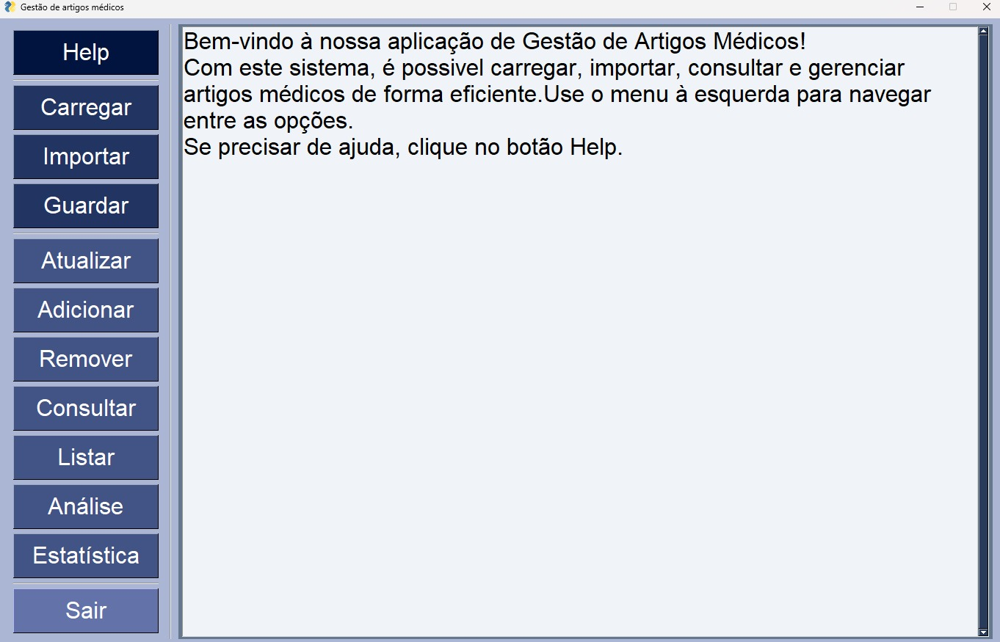

Vamos proceder a uma pequena explicação de cada botão:

1. Help
   Este botão permite abrir um popup com informações sobre a utilização da aplicação, nomeadamente qual o intuito de cada botão, o utilizador pode alterar o que está escrito nesse popup, mas assim que o fechar as alterações não são salvas, nesta funcionalidade fissemos uso de um sg.popup_scrolled, devido a ser uma mensagem grande que não deve ocupar muito espaço.
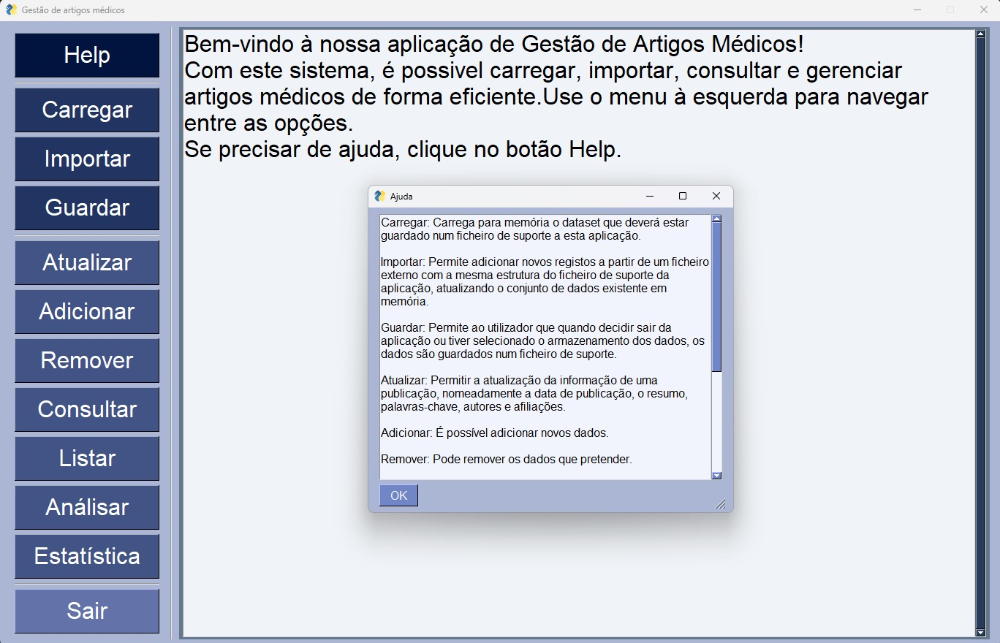
2. Carregar
   Este botão assim que for pressionado, abre um popup que permite ao utilizador navegar pelo seu Browser e selecionar o ficheiro pretendido, sendo que tem preferência pelos ficheiros Json, se a selecão for bem sucedida aparecerá o número de registos do ficheiro e uma mensagem de sucesso, caso contrário dará o feedback da ocorrência de algum problema.
   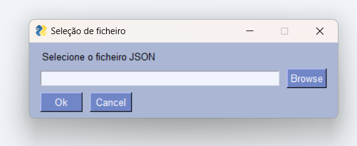
   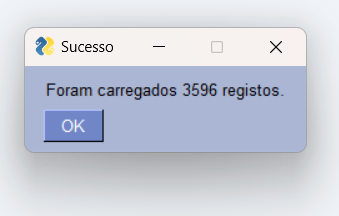
   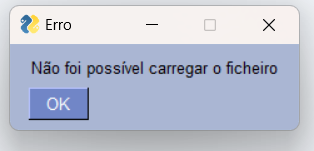
3. Guardar
   Após selecionar esta opção surgirá um popup que pergunta ao utilizador se pretende guardar em ficheiro texto, ou em ficheiro Json, depois de escolhido vai abrir o browser, pedindo ao utilizador que escolha o nome do ficheiro e o seu destino, no fim voltarão a surgir mensagens de feedback.
   
   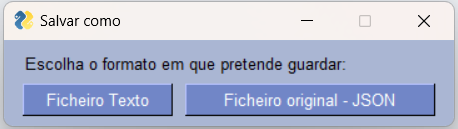
   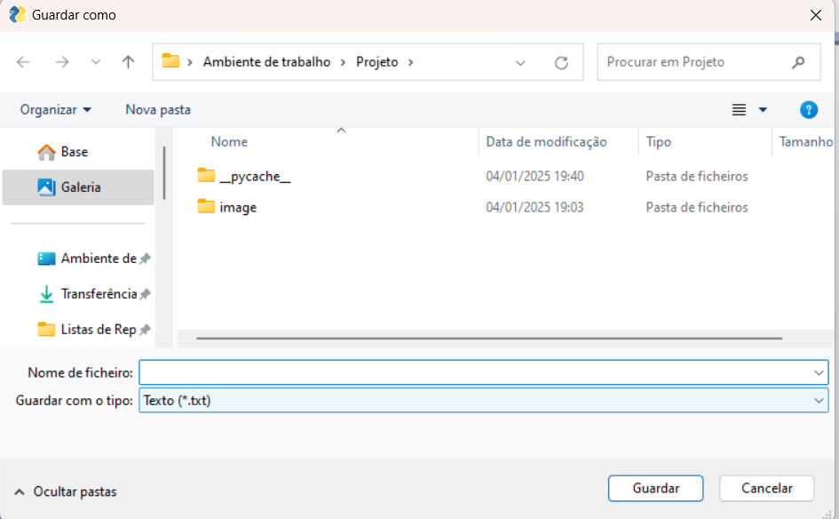
   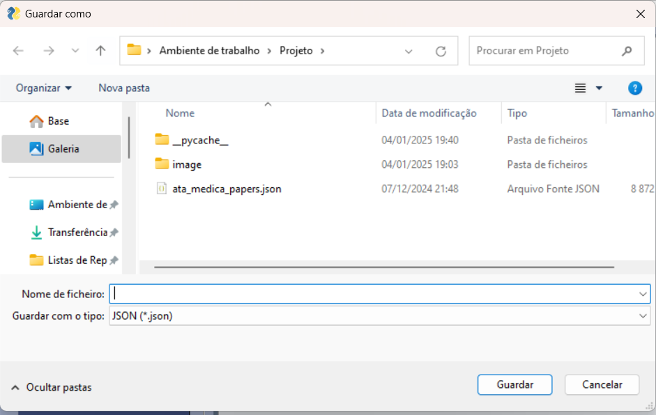
4. Atualizar
   Ao clicar no botão, será aberta uma nova página que permite pesquisar a publicação desejada de acordo com os parâmetros, ainda é possível ordenar essas publicações de acordo com critérios, após localizar a publicação desejada, basta selecioná-la para editar os campos necessários e assim realiza-se a atualização.
   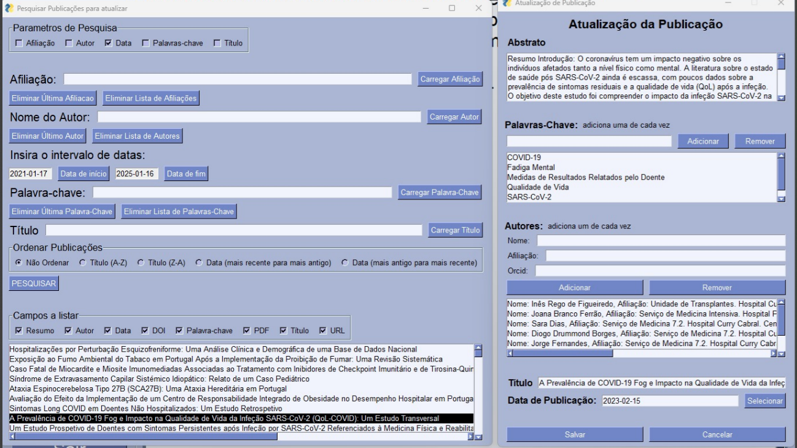
5. Adicionar
   Este botão permite-lhe adicionar publicações ao seu dataset, abrirá uma nova janela, com todos os parâmetros das publicações (vistos ao longo do relatório), que podem ser preenchidos ou não, depois de preencher os campos que o decidir, a nova publicação será inserida no dataset.
   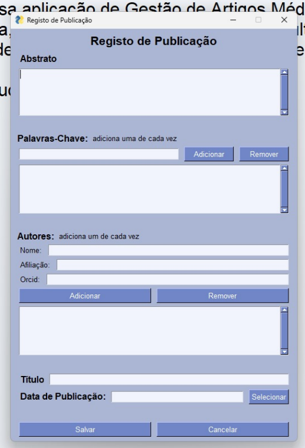
6. Remover
   Após selecionar este botão, surgirá uma nova janela onde o utilizador poderá selecionar o critério de pesquisa do que pretende eliminar ( Autor, afiliação, keyword, data, etc..) depois de escolhido, deve introduzir o autor que pretende procurar (no caso de ter escolhido autor), se um único artigo for encontrado deve selecionar e eliminar, no caso de haver mais do que um artigos terá de selecionar o(s) artigo(s) que deseja eliminar.
   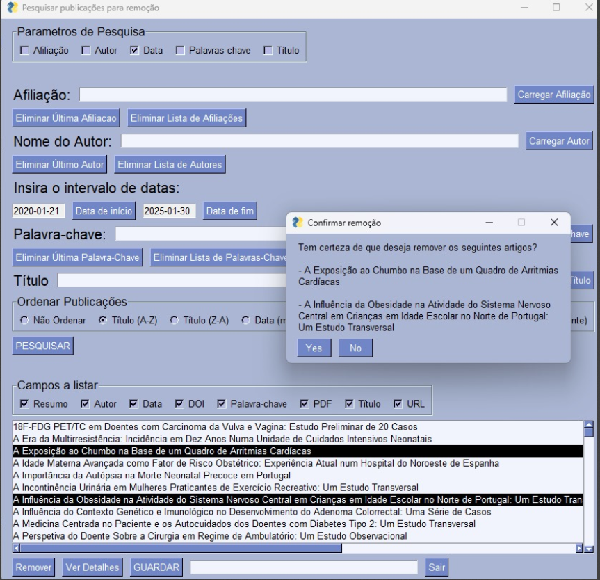
7. Consulta
   Ao clicar no botão aparece na tela uma janela, que pretende presquisar publicações de acordo com um determinado parâmetro (ou vários paramêtros), existem ainda botões para remover o último item ou limpar a lista inteira de afiliações, autores ou palavras-chave, o que pretende procurar deve introduzidos nos espaços indicados e depois serão listadas as publicações correspondentes, ainda é possível ordena-las de acordo com parâmetros ( título ou data de publicação).
   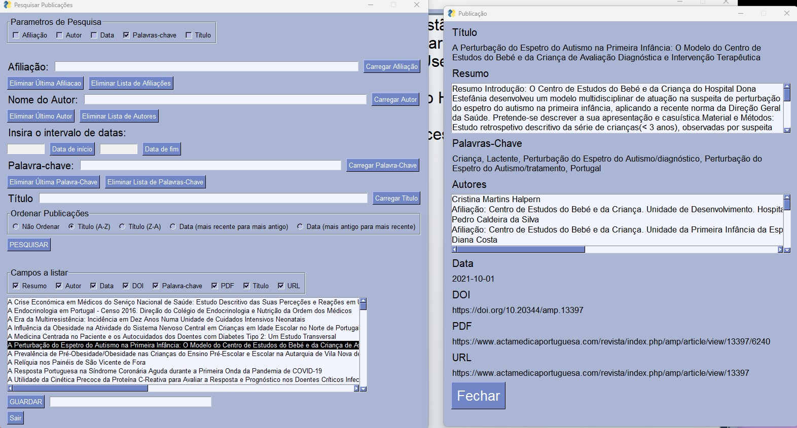
8. Listar
   Após clicar neste botão irão ser listados todas as publicações do dataset e pode clicando nelas os seus detalhes.
   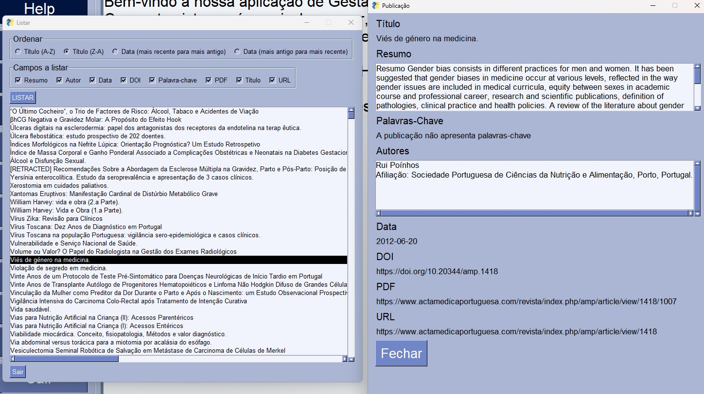
9. Análise
   Após selecionar este botão, será possível listar os autores, ou palavras-chaves, conforme selecionado, por ordem alfabética ou frêquencia de artigos segundo a preferência do utilizador.
   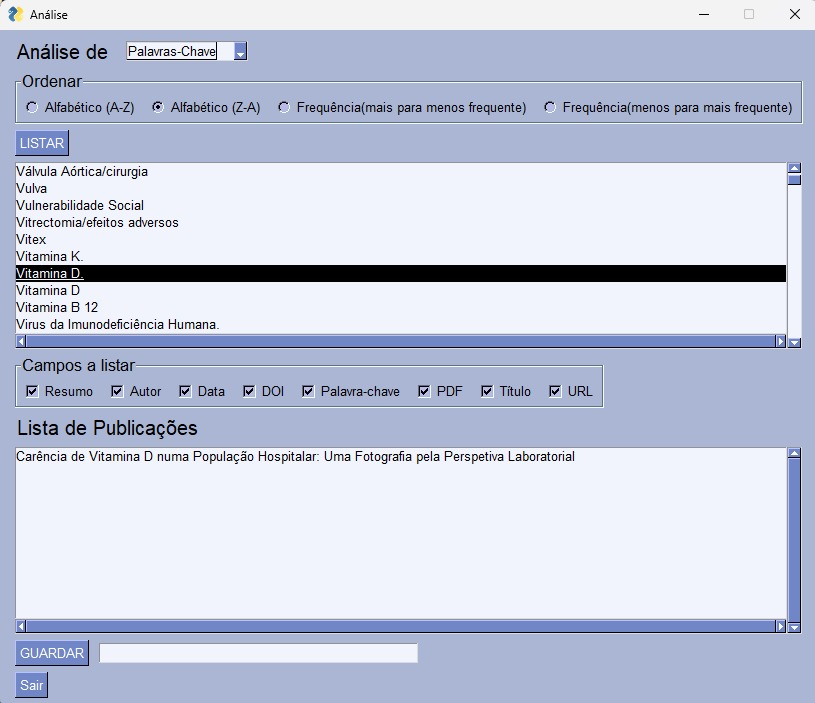
10. Estatística
    Após clicar neste botão irá ser aberta uma nova janela em que pode selecionar a distribuição pretendida, surgirá noutra janela o gráfico referente à distribuição.
    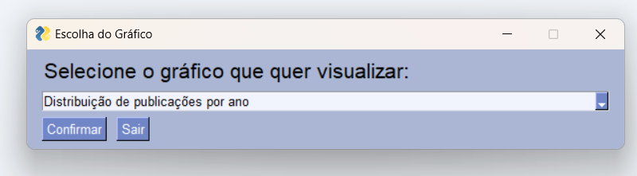
    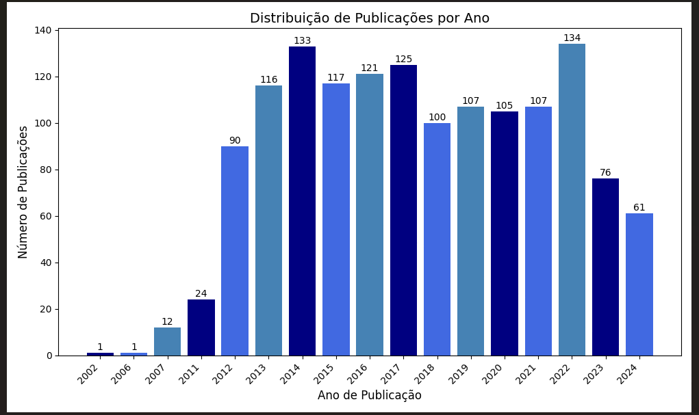
11. Sair
    Permite ao utilizador abandonar a aplicação.
    Criamos duas versões, a mais direta que basta criar no X no canto superior direito, ou em qualquer outro atalho com o mesmo intuito na máquina, a segunda versão baseia-se no botão do menu, quando selecionado um popup abre permitindo realçar o salvamento de dados, se não o fez e quer garantir que os dados são salvos deve clicar em "não" e volta ao menu principal, caso contrário em "sim" e a aplicação irá fechar, assim permitimos ao utilizador duas formas de trabalho.
    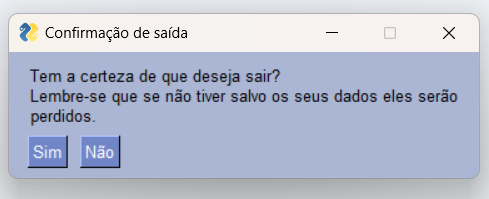
    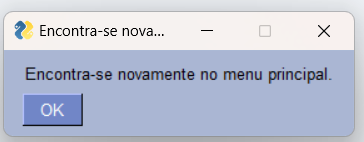
    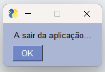

## Conclusão

No início da aprendizagem, achávamos que seria impossível concluir um projeto tão grande e complexo, principalmente devido ao grande número de funções, comandos e interações envolvidas, no entretanto, após a conclusão do processo, percebemos que o projeto, na realidade, não era tão complicado, já que grande parte dos conceitos utilizados foram abordados em aulas ou em TPC’s.

De uma forma geral, acreditamos que este trabalho foi uma ótima maneira de aplicar todas as ferramentas que aprendemos ao longo do semestre, mas também na descoberta de métodos que tínhamos de aplicar para resolver pequenos problemas, ou acrescentar detalhes, além disso, ajudou-nos a compreender melhor o conceito de criação de interfaces, no ínicio parecia dificil, no nosso entender podiamos ter visto mais nas aulas, mas, depois de colocar as mãos no projeto, percebemos que não era tão difícil, fomos expostas a vários novos conceitos e aprendemos muito sobre o que é a Interface, o que pode ser muito útil para trabalhos futuros.

Concluindo encontramo-nos satisfeitas com o resultado, consideramos que concluimos todos os requisitos, um importante destaque é ajuda mútua e correção entre nós, esta tarefa deu-nos a oportunidade de ganhar experiência prática, como tal, agora estamos muito mais confiantes para futuros desafios que possam surgir.

## Webgrafia

1. Site fornecido pelo docente (https://epl.di.uminho.pt/~jcr/AULAS/ATP2024/)
2. Site sobre Python (https://www.w3schools.com/python/default.asp)
3. Site sobre o Py Simple Gui (https://www.pysimplegui.com/)
4. Anotações da aula
